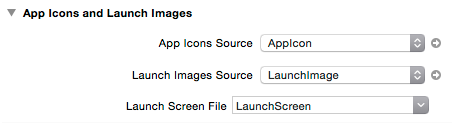

IOS开发常见问题及常用技巧
========================= 

1.升级到iOS 8.0 SDK以后,创建的新项目会带有LaunchScreen.xib文件作为App的启动界面,此时若不作任何设置就把基于8.0 SDK的App运行在7.0等版本的设备上,可能会出现应用不能全屏,为了解决这个问题,可以把plist文件中的LaunchScreenFile相关属性删掉,手动添加LaunchImage图片,也可以由系统自动生成.若想要保留LaunchScreen.xib而又想支持8.0之前的版本,可以在Image.xcassets中添加LaunchImage,在项目General中找到App Icons and Launch Images的LaunchImagesSource项点击User Image assets,完成后系统会自动添加LaunchImage到Image.xcassets中,如图:



2.设置UINavigationController的backBar是否显示文字,
```objc
[[UIBarButtonItem appearance] setBackButtonTitlePositionAdjustment:UIOffsetMake(NSIntegerMin, NSIntegerMin) forBarMetrics:UIBarMetricsDefault];
```

在Swift中实现一样,如下:

```swift
self.navigationItem.backBarButtonItem?.setBackButtonTitlePositionAdjustment(UIOffsetMake(CGFloat.min, CGFloat.min), forBarMetrics: UIBarMetrics.Default)
```
3.关于User Defined Runtime Attributes的使用:即使用InterfaceBuilder中的keyPath来修改组件相关属性,这里只要是API中所拥有的属性,如UIButton的backgroundColor,UINavigationBar的barTintColor等,如图:


4.替代dismissViewController:隐藏视图控制器的技巧:在上层ViewController中定义一个输出口,类似:@IBAction func back(segue: UIStoryboardSegue) {},可以在方法体中获得目标VC的属性等可做进一步的处理,免除了使用旧方法中在两个VC之间值传递时需要设置各种委托的烦恼,简洁易用,在IB中需要进行拖拽连接输出口,如图:


5.NavigationBar 报错nested push animation can result in corrupted navigation bar:导航控制器会报上述错误一般主要是因为一个VC进行了多余一次的push操作而引起的.如:通过长按手势触发push操作时,由于长按手势可能会有不止一种状态,其action会被调用多次,而此时若直接在消息体里面直接进行push的话,就会报以上错误,所以一般在UIGestureRecognizerState.Began状态下进行push,保证只进行一次push操作.

6.自动布局中设置UITextView自动扩展:UITextView是没有Intrinsic Size属性的,不会像UILable那样可以根据内容大小自动更新frame,若想要UITextView的frame根据内容长度自动更新,可设置UITextView不可滚动,在AutoLayout中对其设置约束时除了约束位置外,还需要一个固定的高度约束(如果UITextView是在UIScrollView中,没有此约束系统会发出警告,提示没有垂直方向的位置),但是此高度约束应该在运行时需要取消(在IB中如图),否则高度固定就没法自动更新frame,如图:


7.用CALayer设置视图带边框,常用的属性如下:
```swift
self.layer.masksToBounds = YES;
self.layer.borderWidth = 1.;
self.layer.borderColor = [[UIColor grayColor] CGColor];//此属性不能在IB中设置,因为IB中并没有CGColor类型
self.layer.cornerRadius = 8.0f;
```

8.关于在UILabel下使用.layer属性设置边框过大时，边框会挡住文字的情况,如图：


当然，最好的办法就是居中显示文字，但是如果不想居中显示文字，那解决办法又是怎样呢？先来看看解决的效果，如下：


是不是很完美的解决了？其实很简单，就是自定义一个UILabel的子类：
```swift
class Mylabel: UILabel {
  override func drawTextInRect(rect: CGRect) {
    let insets = UIEdgeInsets(top: 0, left: 10, bottom: 0, right: 0)
    return super.drawTextInRect(UIEdgeInsetsInsetRect(rect, insets))
  }
}
```
对，只需要重写这个方法就一切OK了！

